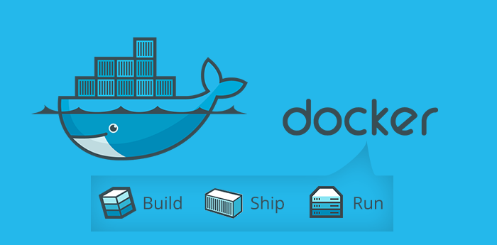
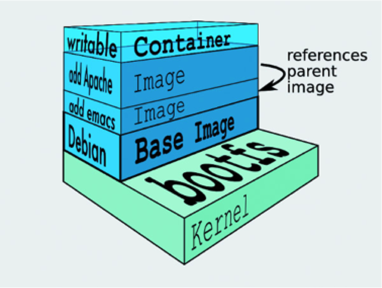
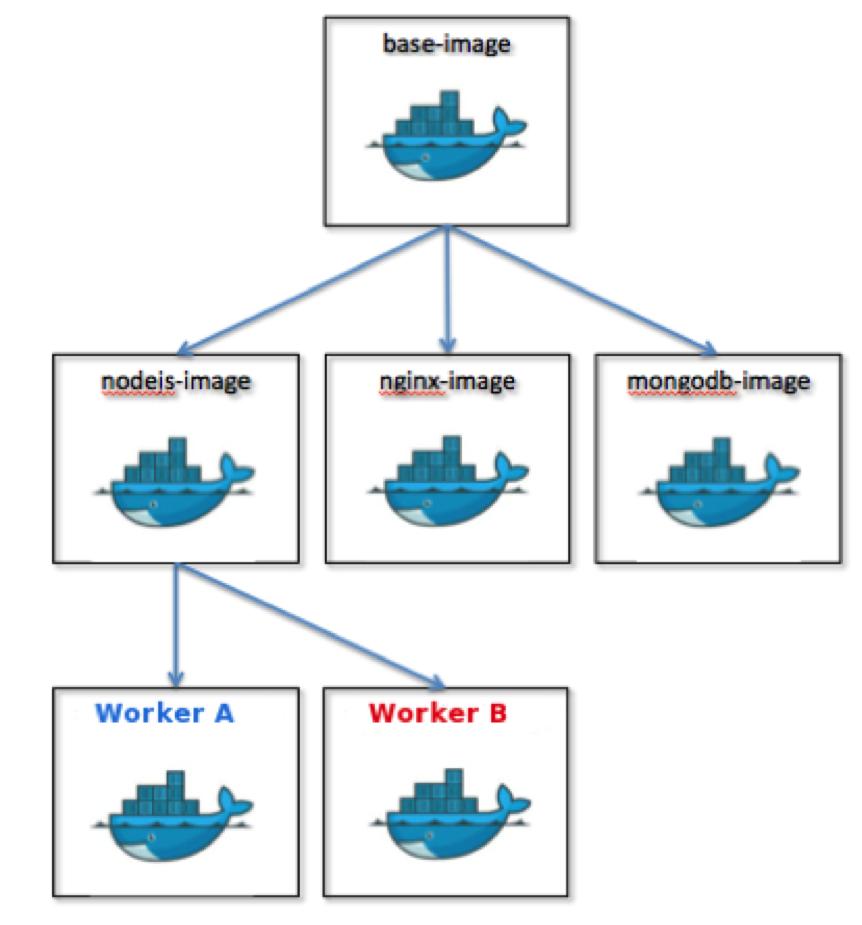

### Was ist Docker?

<!-- .slide: data-background="img/background-orange-orig.jpg" -->

 
  - any app
  - anywhere

Note:
app mit Infrastruktur als immutable Bundle
Pets vs. Cattles

---

### Virtuelle Maschienen vs. Docker

<!-- .slide: data-background="img/background-title-orig.jpg" -->

<table>
    <tbody>
        <tr>
            <td></td>
            <td></td>
        </tr>
    </tbody>
</table>
---

### Virtuelle Maschinen

<!-- .slide: data-background="img/background-title-orig.jpg" -->

- Vorteile
 - gute Auslastung der Hardware
 - Isolierung der Dienste
 - einfache Backups
- Nachteile
 - sehr große Images
 - jede VM lädt eigenen Linux Kernel
 - Hoher Ressourcenbedarf pro VM

---

### Docker

<!-- .slide: data-background="img/background-title-orig.jpg" -->

- Vorteile
 - gleiche Vorteile wie bei VM's
 - Reproduzierbarkeit von Prod
 - durch System-Level-Virtualisierung
   - gute Auslastung der Hardware
   - geringerer Ressourcenbedarf
- Nachteile
 - junge Technologie ???
 - Security ???

Note:
dynamisches Ökosystem

---

### Technik - Docker Engine

<!-- .slide: data-background="img/background-green-orig.jpg" -->

- Kernel-Namespace Verwaltung
 - Prozessisolation im User Space
 - Verwaltung von Prozess-ID, Mount Points, Netzwerk pro Container
- cgroups (control groups)
 - Kernelerweiterung
 - Ressourcenbeschränkung auf Prozess Ebene (CPU, Speicher ...)

Note:
Docker Engine mappt Ressourcen transparent auf Host Ressourcen

---

### Technik - Docker Image

<!-- .slide: data-background="img/background-title-orig.jpg" -->

 - Konvention einer Verzeichnisstruktur
 - Root-Dateisystem
 - binäres Abbild (Snapshot) der Laufzeitumgebung 
 - versionierbar und immutable durch Dateisystem

---

### Stapelbares / Read-Only Dateisystem

<!-- .slide: data-background="img/background-title-orig.jpg" -->

<table>
    <tbody>
        <tr>
            <td></td>
            <td></td>
        </tr>
    </tbody>
</table>

---

### Das Zusammenspiel

<!-- .slide: data-background="img/background-green-orig.jpg" -->

Note:
Achtung bei Mac und Windows! VM ist Docker Host, da Linux Technologie!

