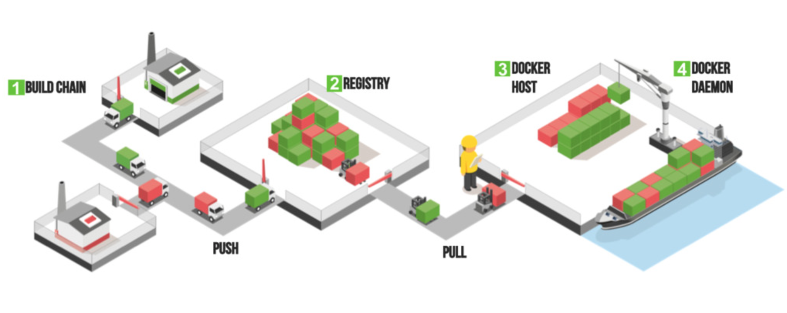
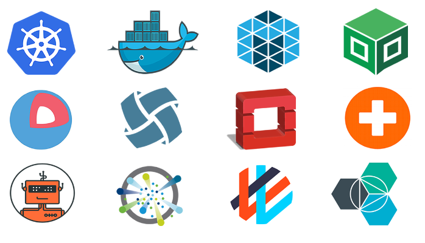

### Ausblick

<!-- .slide: data-background="img/background-orange-orig.jpg" -->

- Volumes
- Daten Container
- Networking
- Security
- Container Orchestration

---

<!-- .slide: data-background="img/background-title-orig.jpg" -->

### Volumes

- Verzeichnisse ausserhalb des LayeredFS
- Host kann Verzeichnisse in den Container mappen
- Volumes können zwischen Containern geteilt werden
- Existieren ausserhalb des Lebenszyklus von Containern
- Änderungen erfolgen direkt (Zugriffzeiten)
- Verzeichnisse sind von Image Updates unabhängig

---

<!-- .slide: data-background="img/background-title-orig.jpg" -->

### Volumes - Beispiel

```
docker run -d -P --name web -v /src/webapp:/opt/webapp training/webapp python app.py
docker inspect web
...
Mounts": [
    {
        "Name": "fac362...80535",
        "Source": "/var/lib/docker/volumes/fac362...80535/_data",
        "Destination": "/webapp",
        "Driver": "local",
        "Mode": "",
        "RW": true,
        "Propagation": ""
    }
]
...
```

Note:
Achtung bei Mac und Windows! Verzeichnis der Vm wird genommen!

---

<!-- .slide: data-background="img/background-title-orig.jpg" -->

### Daten Container

- Idee: Es existieren Container für Volumes
- Achtung: Zugriff muss Data Corruption verhindern

```
Backup erstellen:
docker run --rm --volumes-from dbstore -v $(pwd):/backup ubuntu tar cvf /backup/backup.tar /dbdata

Neuer Container:
docker run -v /dbdata --name dbstore2 ubuntu /bin/bash

Backup wiederherstellen:
docker run --rm --volumes-from dbstore2 -v $(pwd):/backup ubuntu bash -c "cd /dbdata && tar xvf /backup/backup.tar --strip 1"
```

---

<!-- .slide: data-background="img/background-green-orig.jpg" -->

### Networking

- Virtuelle Netzwerke
- Interne Netze
- Multi-Host Netzwerke
- embedded DNS für Container Names

---

<!-- .slide: data-background="img/background-title-orig.jpg" -->

### Security



Note:
1. Build Chain, sichern über trusted Images
2. Ablegen von Images im privater Registry
3. Sicherung des Hosts
4. Sicherung des Daemon (Läuft als Root)
5. Ausbrechen aus dem Container

---

<!-- .slide: data-background="img/background-title-orig.jpg" -->

### Docker 1.10 (4. Februar)

- User namespace
 - Container Prozesse werden vom Host im Userspace isoliert
- Seccomp profiles
 - Definition von Filtern für Systemcalls
 - Syscalls Blockierung im Container
 - Ausblick: Security Profiles (Networking, Filesystem)
- Authorization Plugin
 - AAM für die Docker API
- Ausblick: PID cgroups
 -  Limitierung von Prozessen im Container

 Note:
 Container Prozesse denken sie sind Root, sind aber ein eigener User

---

<!-- .slide: data-background="img/background-green-orig.jpg" -->

### Container Orchestration



Note:
- Unterstützung durch Big Names
- Diverse Orchestrierungstools verfügbar
- CoreOS als Container OS Beispiel

---

<!-- .slide: data-background="img/background-green-orig.jpg" -->

### Cloud


Note:
- Unterstützung von private, public und hybrid-cloud
- Infrastruktur Provider unabhägig (AWS, Azure, etc.)
